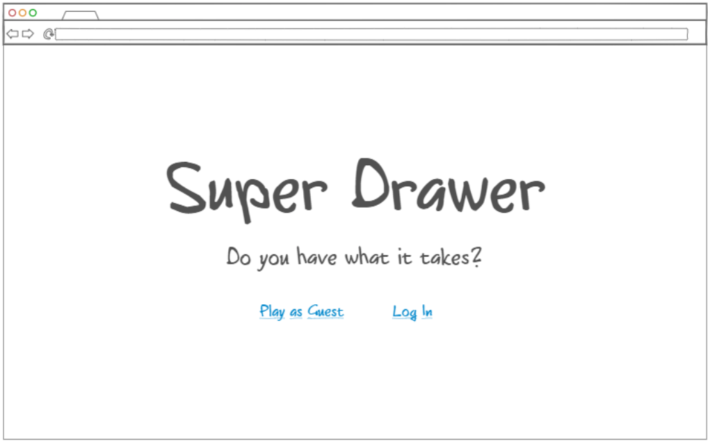
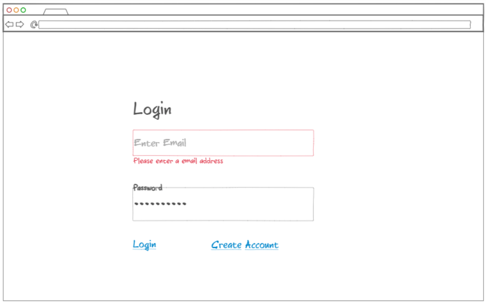
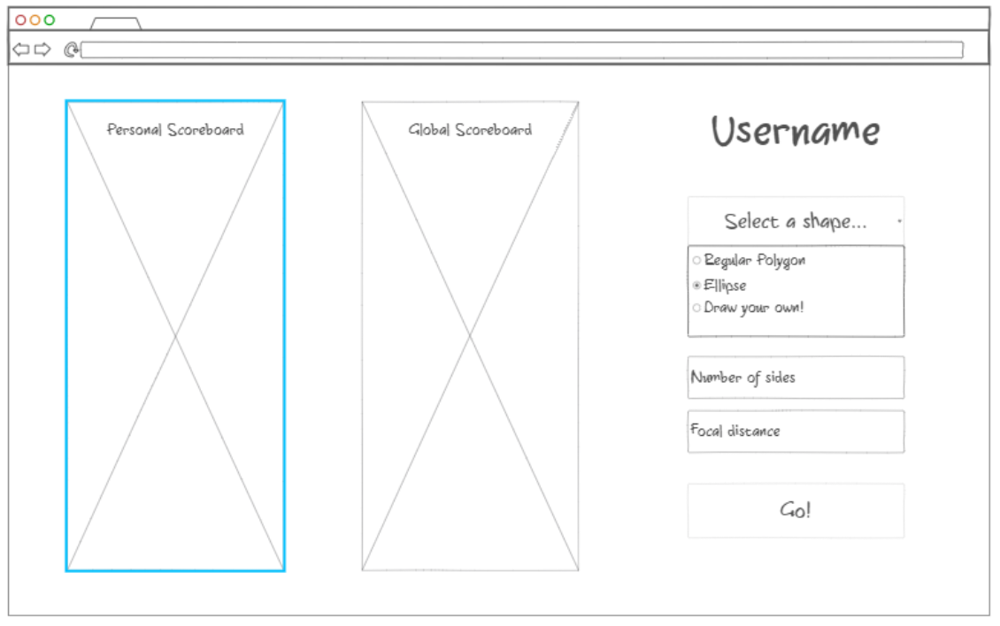
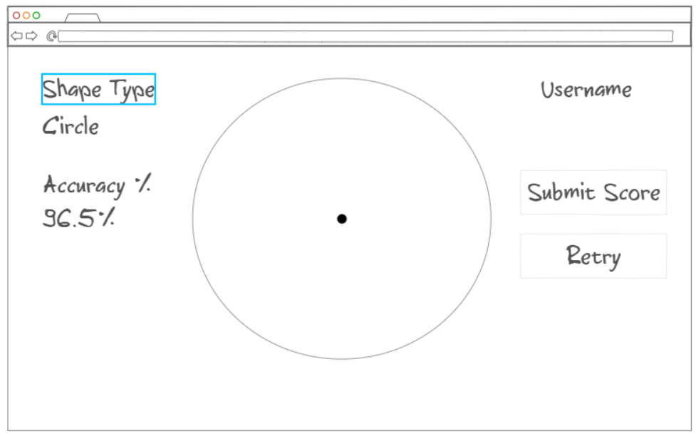

# Sketch Accuracy Checker
## Specification Deliverables
### Elevator Pitch
Accurately drawing geometric shapes can be difficult without the aid of external tools. What if there was a way to practice? This project compares user-drawn shapes to regular polygons and calculates average accuracy rate based on distance from the center. User-submitted shapes will be automatically scaled and rotated to align with the desired shape type. Users can also locally submit their own simple shapes for practice purposes. Highest accuracy rates for each shape type (not including user-submitted shapes) will be displayed on a scoreboard with all-time high scores. Global high scores for each shape type will be visible for registered users.
### Key Features
There will be three shape types available from a drop-down menu:
1. Regular polygons. The user can select the number of sides on the polygon from `n = 3` sides to `n = 12` sides.
2. Ellipses. The user can select the focal distance of the ellipse. Note a focal distance of 0 will generate a perfect circle.
3. User-generated shapes. The user will first draw a simple curve, then will set a name for their shape. This shape will be stored locally in the drop down menu until the user is logged out of the system.

Once a shape type has been selected, the user will be taken to a screen where they attempt to reproduce their selected shape. The user can select if they would like their chosen shape to be visible or invisible while drawing. Scores will be stored separately in the database for visible and invisible shapes.

The visual center of user-drawn shapes will be located using the algorithm found [here](https://github.com/mapbox/polylabel), then aligned and rotated to match as closely as possible to the original shape. Accuracy will be determined by comparing the scaled distance of points on the curve to the distances on the original curve. 

New shape types can permanently be added from the backend.

### Design
The below images show the separate pages that will be utilized for this program.\
Home page:

Login page:

Shape interface page:

Drawing page:

### Technologies Used
I am going to use the required technologies in the following ways.

- **HTML** - Four HTML pages as shown in Design section. Hyperlinks and dropdown menus used to select shape choices.
- **CSS** - Colors, whitespace, and graphic effects while drawing shapes. Scoreboard formatting.
- **JavaScript** - Provides login, buttons, backend calls.
- **Service** - Backend service with endpoints for:
  - login
  - retrieving global and personal high scores
  - submitting global and personal high scores
- **DB/Login** - Store users and high scores in database. Register and login users. Credentials securely stored in database. Can't submit scores unless authenticated.
- **WebSocket** - Notifications are sent to all users when global high scores change.
- **React** - Web framework.

### HTML deliverable

For this deliverable I built a basic structure for my website in HTML.

- **HTML pages** - Four HTML pages: welcome screen, login screen, shape selection screen, and drawing screen.
- **Links** - The welcome page redirects guest users to the shape selection screen and other users to the login screen. The login screen directs users to the shape selection screen after logging in or creating an account. The shape selection screen directs users to the drawing screen after specifying shape parameters. The drawing screen directs users to the shape selection screen after drawing a shape. Both the shape selection screen and drawing screen contain a redirect link to the login screen.
- **Text** - Filler text is listed for the shape selection options and personal/global scoreboards.
- **Images** - A placeholder image is included on the drawing screen to represent the shape that the user will attempt to replicate.
- **Database** - The personal and global scoreboards on the shape selection screen have been populated in a table with sample data to represent the individual and global high scores of players for each shape type.
- **Websocket** - The global scoreboard will update in real time when a new highest accuracy score is achieved by a registered user.

### CSS deliverable

For this deliverable I formatted my existing HTML code with Bootstrap CSS.

- **Header** - Each page has a header with links to the other pages minus the drawing screen. This screen is not linked in the header as in the future its format will be dependent on the input from the select screen. Links change color on hover.
- **Footer** - Each page has a footer with my name and a link to the Github repository in the far right corner.
- **Main body** - Body of each page is styled with flex to ensure compatability across multiple devices.
- **Navigation elements** - Links to all pages except drawing page are contained in the header. Other links between pages are implemented with Bootstrap buttons.
- **Responsive to window resizing** - Pages are designed with flex to accomodate multiple window sizes. Readability is somewhat compromised for very small screens due to the amount of elements present on many screens.
- **Application elements** - Elements are consistently spaced across screens and employ basic Bootstrap formatting for color and structure.
- **Application text content** - Text is selectively resized and aligned on all screens. Placeholder text included for future deliverables.
- **Application images** - Draw screen contains a dynamically resizable image representing the maximum area in which the user will draw their shape. Size of the image is scaled across all browser sizes.